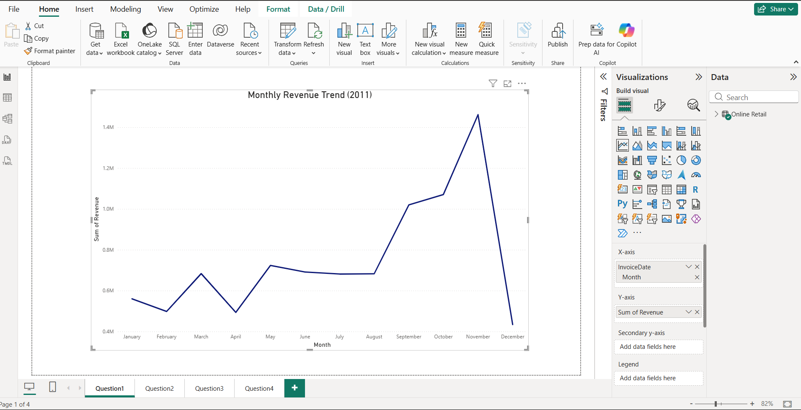
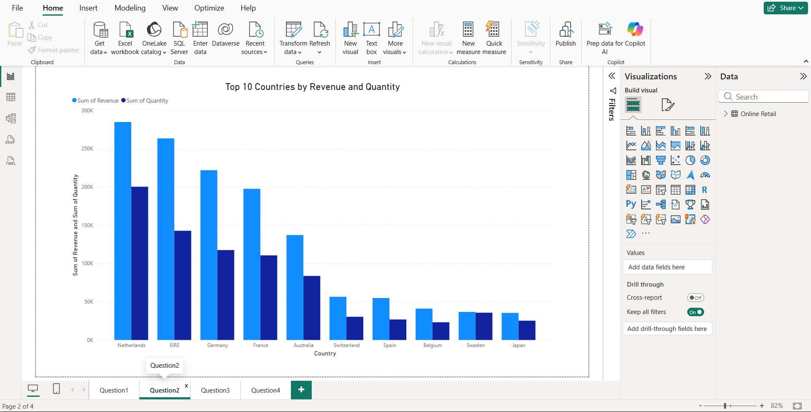
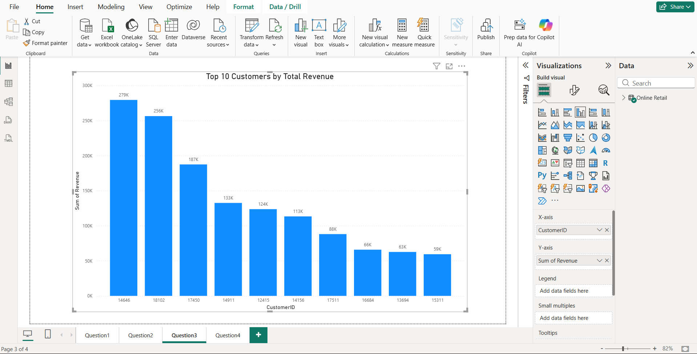
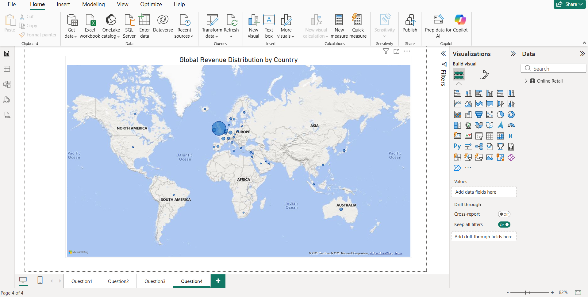

# Sales Performance Dashboard | Power BI

## 📊 Project Overview

This project presents an interactive Sales Performance Dashboard developed using Microsoft Power BI. The dashboard analyzes retail sales data to identify revenue trends, customer performance, country-wise sales patterns, and global revenue distribution.

The objective of this project is to transform raw sales data into meaningful business insights through clear and interactive data visualizations.

## 🎯 Key Objectives

- Analyze monthly revenue trends and identify sales patterns.
- Identify top-performing customers based on revenue.
- Compare revenue performance across different countries.
- Analyze the geographical distribution of sales.
- Present business data through clear and effective visualizations.

## 📈 Dashboard Analysis

### Monthly Revenue Trend
The monthly revenue visualization provides an overview of revenue performance throughout the year and helps identify fluctuations and periods of strong sales performance.

### Top Countries by Revenue
This visualization compares sales performance across countries, helping identify the markets contributing significantly to overall revenue.

### Top Customers by Revenue
This analysis highlights the highest-value customers based on their revenue contribution.

### Global Revenue Distribution
The geographical visualization provides a global perspective of revenue distribution and helps identify key markets.

## 🛠️ Tools & Technologies

- Microsoft Power BI
- Data Visualization
- Data Analysis
- Power Query
- Data Modeling

## 📂 Project File

The complete Power BI report is available in this repository:

`Retail_PowerBI.pbix`

## 💡 Skills Demonstrated

- Business Data Analysis
- Dashboard Development
- Data Visualization
- Sales Performance Analysis
- Data Interpretation
- Power BI Reporting

## 📌 Conclusion

This project demonstrates the use of Power BI to analyze retail sales data and convert it into actionable business insights through interactive and easy-to-understand visualizations.
